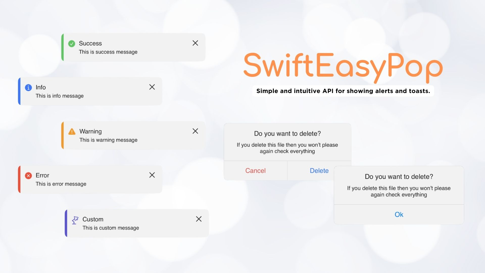

# SwiftEasyPop

SwiftEasyPop is a lightweight and easy-to-use SwiftUI library for displaying custom alerts and toasts in a Swift application. It provides a flexible way to present customizable alerts and toasts with minimal setup.

## Features

- 🚀 Simple and intuitive API for showing alerts and toasts.
- 🎨 Highly customizable, supporting custom icons, colors, and messages.
- 📱 Compatible with iOS 14.0+.
- 🔄 Supports both light and dark mode.
  


## Installation

### Swift Package Manager

You can add SwiftEasyPop to your project via Swift Package Manager. Add the following dependency to your `Package.swift` file:

```swift
dependencies: [
    .package(url: "https://github.com/tunahancelik/SwiftEasyPop.git", from: "1.0.0")
]
```
## Usage
Import SwiftEasyPop into your SwiftUI view and use the provided modifiers to present alerts and toasts.

```swift
import SwiftUI
import SwiftEasyPop

struct ContentView: View {
    @State private var showAlert = false
    @State private var showToast: EasyToastView? = nil

    var body: some View {
        // Your view code
    }
}
```

### Showing an Alert
```swift
// Use EasyAlertPop to show custom alerts
Button("Show Alert") {
    showAlert = true
}
.easyAlertPop(presentAlert: $showAlert, alertType: .constant(.oneButton(...)))
```
### Showing a Toast
```swift
// Use EasyToastView to show custom toasts
Button("Show Toast") {
    showToast = EasyToastView(...)
}
.toastView(toast: $showToast)
````
### Customization
SwiftEasyPop allows for extensive customization of alerts and toasts. You can set custom icons, messages, colors, and more.

### Contribution
Contributions are welcome! Please read the contribution guidelines first.

### License
SwiftEasyPop is released under the MIT License.
